# Portfolio-Optimization-with-Clustering

## Creating a Diversified Profile Using Unsupervised Learning

This is a python enabled command line interface that aims to create a diversified investment portfolio  using unsupervised machine learning by clustering cryptocurrecies.Clustering groups of investments according to patterns in their returns provides valuable information to assemble investment portfolios.

The attempt is to use K-means algorithm with principal component analysis (PCA) data to find hidden relationship in tha data.It clusters the crypto performance in different time periods accordingly into segments that can be used to assemble investment portfolio to optimize it's performance.

This analysis consist of a Jupyter notebook that clusters cryptocurrencies by their performance in different time periods and includes the following:

* Importing the Data 
* Preparing the Data 
* Finding the Best Value for k Using the Original Data
* Clustering Cryptocurrencies with K-means Using the Original Data
* Optimizing Clusters with Principal Component Analysis
* Finding the Best Value for k Using the PCA Data
* Clustering the Cryptocurrencies with K-means Using the PCA Data; and
* Visualizing and Comparing the Results


## Technologies
This project runs on python 3.7 and includes the following libraries and dependencies:

* Pandas
* scikit-learn
* Pathlib
* hvPlot
* Jupyter Notebook
* KMeans from sklearn
* PCA from sklearn
* StandardScaler from sklearn

## Installation Guide

To use the application you need to install the following dependencies.

```python
  pip install -U scikit-learn
  pip install pathlib
  conda install -c pyviz hvplot
```
---

## Usage

To use this application just clone the repository and run the **jupyterlab** by running the following command on your terminal:

```jupyterlab```

Upon launching the application  on jupyter lab run the file by clicking on the play button on top of the notebook. 

### Usage Examples

## Summary Statistics

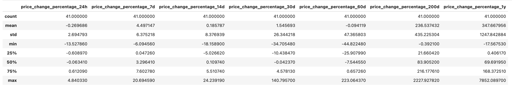

## Data Visualization

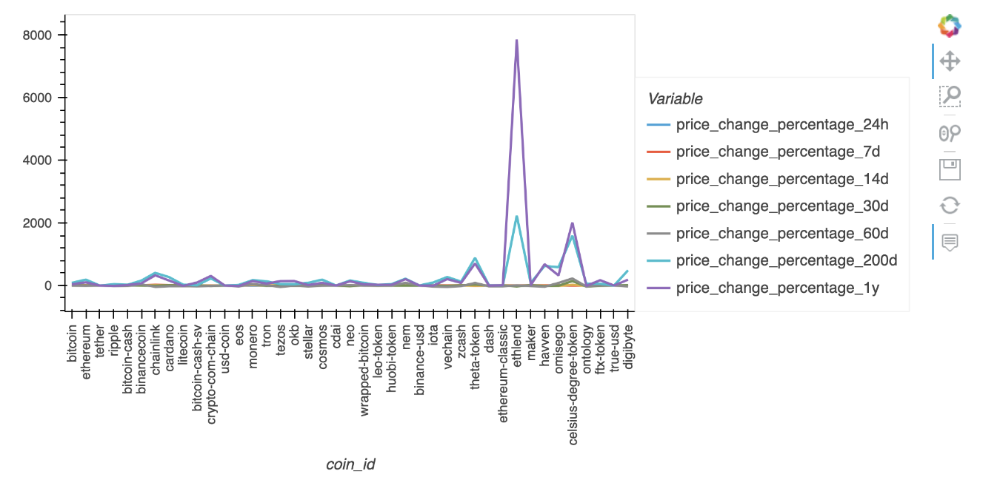

## Scaled Data

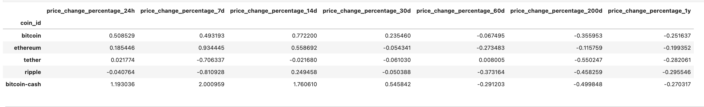


## Finding the Best Value for K Using the Original Data

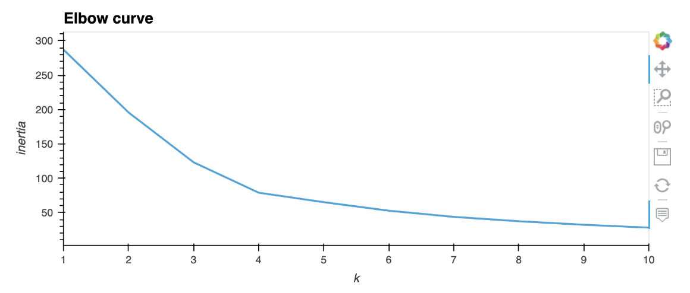

Observing the plot, it seems 4 would be the optimal number for k's value because the elbow shape starts at this point.

## Cluster Cryptocurrencies with K-means Using the Original Data

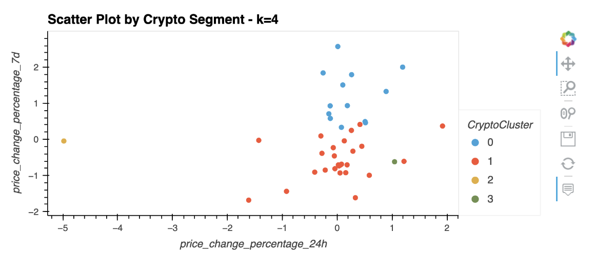

## Optimize Clusters with Principal Component Analysis

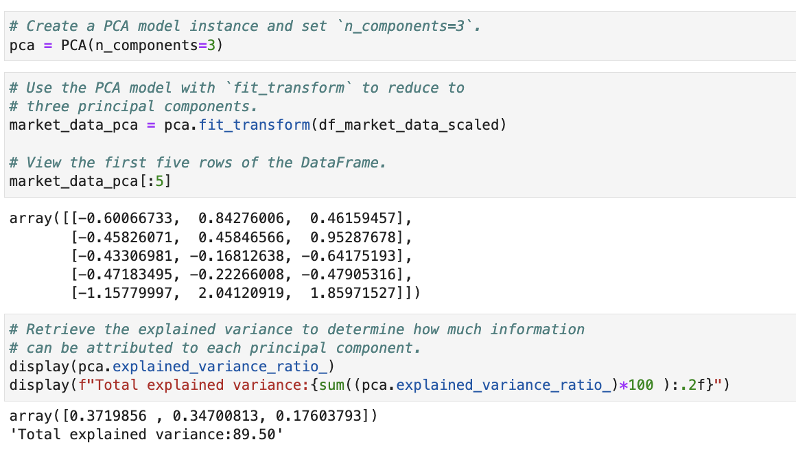

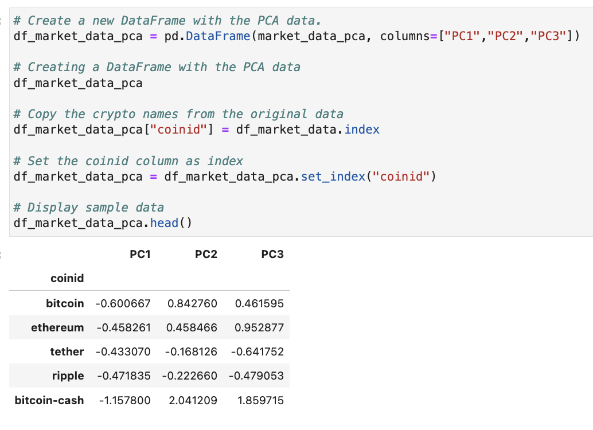

After getting the explained_variance_ratio_ attribute, we can observe that the first principal component contains 37.19% of the variance,the second principal component contains 34.70% of the variance, and the third principal component contains 17.60% of the variance. All three components together thus contain 89.50% of the original information.


## Finding the Best Value for k Using the PCA Data

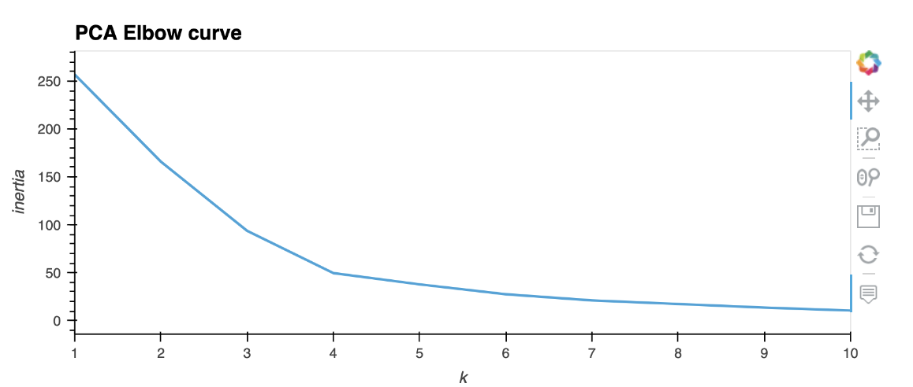

Since the elbow shape is starting at point 4, this seems the optimal k value.

## Cluster Cryptocurrencies with K-means Using the PCA Data

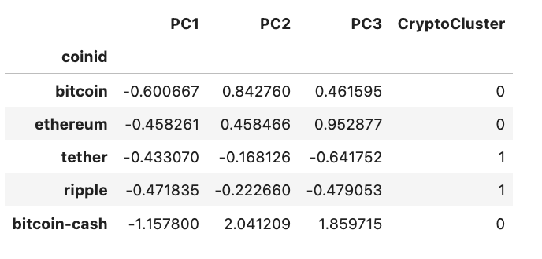

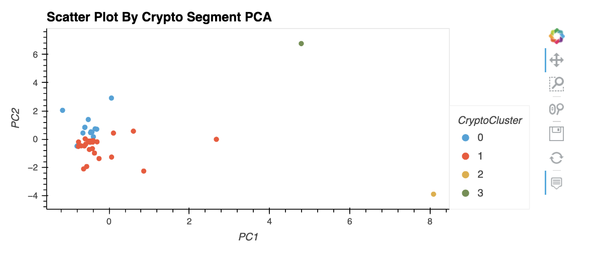

## Visualize and Compare the Results

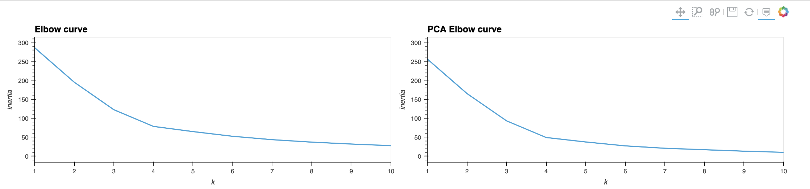


Using both original and PCA data is giving the same result. In both the visuals the elbow shape is taking place at 4.

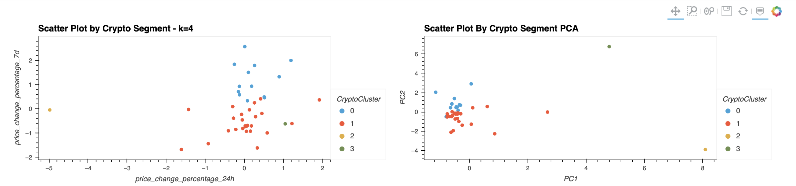


After analyzing the cluster analysis visualizations results, it is evident that using fewer features for clustering the data is giving low value of inertia with high concentration and low spread of data points. This optimizes the identification of clusters when using KMeans algorithm and eases the visualization of clusters.With these defined clusters, new strategies can be devised relevant to each cluster aimed at optimizing the perfomance of the portfolio.However, the optimal number of principal components depends on how much variance you want to allow in your data.In practice, you can test the different number of components and choose the best number for your business case.
___


## Contributers

Manisha Lal

08/24/2022

manisha.lal.2009@gmail.com
___


## License

copyright 2022


